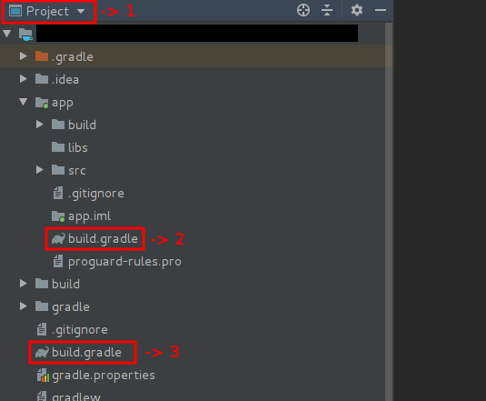
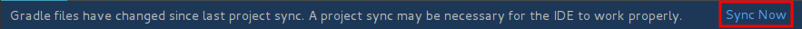

[  ](https://bintray.com/likethesalad/public-repo/string-reference/_latestVersion)
[]( https://android-arsenal.com/details/1/7967 )
# Android String XML Reference

Table of Contents
---
  * [What is it](#what-is-it)
  * [How to use](#how-to-use)
     * [1.- Templates](#1--templates)
     * [2.- Running it](#2--running-it)
     * [2.1- How to know if it worked?](#21--how-to-know-if-it-worked)
     * [2.2- Where do resolved strings go to?](#22--where-do-resolved-strings-go-to)
  * [Adding it to your project](#adding-it-to-your-project)
     * [1.- Where to find the build.gradle files](#1--where-to-find-the-buildgradle-files)
     * [2.- What to add to the build.gradle files](#2--what-to-add-to-the-buildgradle-files)
     * [2.1- Changes to your Root's build.gradle file](#21--changes-to-your-roots-buildgradle-file)
     * [2.2- Changes to your App's build.gradle file](#22--changes-to-your-apps-buildgradle-file)
  * [Running it manually](#running-it-manually)
  * [License](#license)


What is it
---
Android String XML Reference is a Gradle plugin which resolves placeholders
of XML strings referenced into other XML strings
at buildtime. You won't have to write any Java or Kotlin code into your
project to make it work and you will still be able to access to the 'resolved'
strings the same way as with any other manually added string to your
XML files.

In other words, if you're looking to do something like this:

#### Input:
```xml
<resources>
    <string name="app_name">My App Name</string>
    <string name="template_welcome_message">Welcome to ${app_name}</string>
</resources>
```
#### Output:
```xml
<!-- Auto generated -->
<resources>
    <string name="welcome_message">Welcome to My App Name</string>
</resources>
```
Without having to write any Java or Kotlin code, then this plugin might help you.

How to use
---
### 1.- Templates
All you have to do is to define string templates inside your XML string files,
the file to add these templates to can be any file inside your values folders,
not necesarily the "strings.xml" file but any other within the same directory will
work too.
In order to create a template all you need to do is to set its name with the
`template_` prefix. So for example, if you want your final "resolved" string name
to be "my_message", then its template name will be like so:

> <string name="template_my_message">

Your templates will contain references to other strings in the form
of "placeholders", the placeholder format is `${another_string_name}` where
"another_string_name" will be the name of any other string you have in your project.

Following our example above for our "template_my_message" template, let's say that
we have another string in our project named "app_name" (which content is "My app name") and we want to place it inside our "template_my_message" template, we can do it like so:

```xml 
<string name="template_my_message">Welcome to ${app_name}</string>
```

A template can contain from zero to any amount of placeholders. Any string within your values folder (even other templates) can be referenced inside a placeholder.
And that's it, we've defined a template with a placeholder inside. Meaning that
when we run the plugin, we'll get as a result the following "resolved" string:

```xml 
<!-- Auto generated -->
<string name="my_message">Welcome to My app name</string>
```

Notice that for the final "resolved" string name, the `template_` prefix has been removed.

### 2.- Running it
By default, the task that resolves the string templates will run during
your app's build process, unless you want to change this and rather
running it manually, which is explained below under `Running it manually`.

Since it runs by default during your project's build, then there's many ways of running it, some of those could be:

- By pressing on the "play" button of Android Studio: 
- Or, by pressing on the "make" button on Android Studio: 
- Or, if you prefer command line, then you can run it by calling the build command: `./gradlew build` or the assemble command: `./gradlew assemble` or by calling the specific task to resolve the strings which has the following format: `./gradlew resolve[BUILD_VARIANT]Placeholders` more info on this command below under "**Running it manually**".

### 2.1- How to know if it worked?

After the task has run, now you will be able to access to the "resolved" strings,
which are the previously defined "templates" but without the `template_` prefix.
So following our previous example of our template "template_my_message", we now
will be able to access to the new auto-generated resolved string: `my_message`, the
same way as with any other string, e.g. This way for Java and Kotlin: `R.string.my_message` and this way for XML layouts: `@string/my_message`.

### 2.2- Where do resolved strings go to?
By default the resolved strings go into your app's `build` folder, specifically under the `build/generated/resolved` path. That's where this plugin places them into when it is run. The build folder is usually ignored for a VCS repository, so the resolved strings won't go into your repo unless you want to change it by applying the following configuration into your app's `build.gradle` file:

```groovy
// Optional:
stringXmlReference {
    keepResolvedFiles = true // By default it is false.
    // If false: Resolved strings will go into the 'app/build' dir (which is a hidden dir for your VCS).
    // If true: Resolved string will go into the 'app/src' dir.
}
```

The following cases are supported:

- Regular base strings.
- Multi-language strings.
- Flavor specific strings.
- Flavor specific with multi-language strings.


> Both **values and templates** can be overriden for a different **language** and
> also for a different **flavor**. So if for example you have templates in your
> project which contain the app name placeholder (e.g. ${app_name}) then if you
> need to create a flavor with a different app name value, you just have
> to override the '*app_name*' string inside the flavor's 'values' foler 
> and that's it, now for this flavor you'll get all of the old strings but with
> the new app_name.

> Same for languages, based on the example above, if you need to translate your
> '*my_message*' string to spanish for example, you just have to override the template
> '*template_my_message*' inside the 'values-es' folder and you'll get the
> translated '*my_message*' string in the 'resolved.xml' file inside the 'values-es' folder.

Use case examples
---
Here's a couple of examples for some of the use cases supported by this plugin

### 1.- Simple use case
Within our `app/main/res/values` folder, we have the following file:
```xml
<!--strings.xml-->
<resources>
    <string name="app_name">Test</string>
    <string name="template_welcome_message">Welcome to ${app_name}</string>
</resources>
```
After building our project we get:
```xml
<!--Auto generated-->
<resources>
    <string name="welcome_message">Welcome to Test</string>
</resources>
```
### 2.- Multi files use case
Within our `app/main/res/values` folder, we have the following files:
```xml
<!--strings.xml-->
<resources>
    <string name="app_name">Test</string>
    <string name="template_welcome_message">Welcome to ${app_name}</string>
    <string name="template_app_version_name">The version for ${app_name} is ${my_version}</string>
</resources>
```
```xml
<!--my_configs.xml-->
<resources>
    <string name="my_version">1.0.0</string>
</resources>
```
After building our project we get:
```xml
<resources>
    <string name="app_version_name">The version for Test is 1.0.0</string>
    <string name="welcome_message">Welcome to Test</string>
</resources>
```
So no matter which file contains a template or a value used in a template, as long as it's within your app's values folders, then the plugin will find it.
### 3.- Multi languages use case
Within our `app/main/res/values` folder, we have the following file:
```xml
<!--strings.xml-->
<resources>
    <string name="app_name">Test</string>
    <string name="template_welcome_message">Welcome to ${app_name}</string>
</resources>
```
Then, Within our `app/main/res/values-es` folder, we have the following file:
```xml
<!--any_file.xml-->
<resources>
    <string name="template_welcome_message">Bienvenido a ${app_name}</string>
</resources>
```
After building our project, what we get for our default `values` folder is:
```xml
<!--Auto generated-->
<resources>
    <string name="welcome_message">Welcome to Test</string>
</resources>
```
And then what we get for our spanish `values-es` folder is:
```xml
<!--Auto generated-->
<resources>
    <string name="welcome_message">Bienvenido a Test</string>
</resources>
```
### 4.- Flavors use case
Let's say we've defined a flavor in our project, named `demo`, then:

Within our `app/main/res/values` folder, we have the following files:
```xml
<!--strings.xml-->
<resources>
    <string name="app_name">Test</string>
    <string name="template_welcome_message">Welcome to ${app_name}</string>
    <string name="template_app_version_name">The version for ${app_name} is ${my_version}</string>
</resources>
```
```xml
<!--my_configs.xml-->
<resources>
    <string name="my_version">1.0.0</string>
</resources>
```
And for our `app/demo/res/values` folder we add the following file:
```xml
<!--any_file.xml-->
<resources>
    <string name="app_name">Demo app</string>
</resources>
```
After building the `demo` variant of our project, we'll get for such variant:
```xml
<!--Auto generated-->
<resources>
    <string name="app_version_name">The version for Demo app is 1.0.0</string>
    <string name="welcome_message">Welcome to Demo app</string>
</resources>
```
So we see that the `app_name` value has been overridden by the demo's app_name, this doesn't only happen for values but also for templates, we can also override templates within our demo's resources.

Those were some of the use cases that you can achieve using this plugin, there's more of them such as overriding flavor's multi languages from the base values folder and also working with multi-dimension flavors. You can play around with it, it all should work the way you'd expect it to work.

Adding it to your project
---

We're going to need to modify two `build.gradle` files in our project in order to make
this plugin work, those are:

- **Root's** `build.gradle`
- **App's** `build.gradle`

### 1.- Where to find the build.gradle files
To get a better idea of where you can find these files, take a look at this Android Studio
screenshot below:



- The **number 1** selection is to make sure that you've selected the "Project"
view in order to see the `build.gradle` files as shown on this image.
- The **number 2** selection represents your **App's build.gradle** file.
- The **number 3** selection represents your **Root's build.gradle** file.

### 2.- What to add to the build.gradle files

### 2.1- Changes to your Root's build.gradle file
First, in your `Root's build.gradle` file, you'll need to add this
line into your `buildscript` dependencies block:

```groovy
classpath "com.likethesalad.android:string-reference:1.0.0"
```
Example:

```groovy
// Root's build.gradle file
buildscript {
    repositories {
        jcenter()
        //or
        mavenCentral()
    }
    dependencies {
        //...
        classpath "com.likethesalad.android:string-reference:1.0.0"

        // NOTE: Do not place your application dependencies here; they belong
        // in the individual module build.gradle files
    }
}
```
> Please note that you must also add (if not there already) either `jcenter()` or `mavenCentral()`
> to your buildscript's repositories block as shown above.

### 2.2- Changes to your App's build.gradle file

In your `App's build.gradle` file you have to add the following line below the `apply plugin: 'com.android.application'`
one:

```groovy
apply plugin: 'placeholder-resolver'
```

Example:

```groovy
// App's build.gradle file
apply plugin: 'com.android.application'
apply plugin: 'placeholder-resolver'

android {
  //...
}
```
### 2.3- Sync your project



After your changes to the build.gradle files are done, you should see the above message in Android Studio
that has a "Sync Now" button. You have to click on that button for the changes to take effect. After the
sync is done, you'll be ready to go! you can start adding your string templates to your app's resources.

Running it manually
---
The task that resolves the string templates is incremental,
it won't run unless there are changes to the templates and/or
their values. Meaning that your build process won't have to run this
task every time you compile, but only when it is needed.

If you still want to avoid running the templates resolver task
automatically during the build process and rather running it manually, then
you can turn it off by adding the following into your application's
`build.gradle` file, where you've added this plugin:
```groovy
stringXmlReference {
  resolveOnBuild = false
}
```

And that's it, now you'll have to make sure to trigger the task
manually whenever you need your resolved strings to get
updated by running: `resolve[BUILD_VARIANT]Placeholders` depending
on your build configuration. For example, to run it for the debug variant,
you'll have to run: `resolveDebugPlaceholders`, or if you have flavors
setup in your application, e.g. say you have 'demo' as a flavor defined,
then you can run `resolveDemoDebugPlaceholders` to generate the strings
for the demo flavor on the debug variant and so on.

License
---
    MIT License
    
    Copyright (c) 2019 LikeTheSalad.
    
    Permission is hereby granted, free of charge, to any person obtaining a copy
    of this software and associated documentation files (the "Software"), to deal
    in the Software without restriction, including without limitation the rights
    to use, copy, modify, merge, publish, distribute, sublicense, and/or sell
    copies of the Software, and to permit persons to whom the Software is
    furnished to do so, subject to the following conditions:
    
    The above copyright notice and this permission notice shall be included in all
    copies or substantial portions of the Software.
    
    THE SOFTWARE IS PROVIDED "AS IS", WITHOUT WARRANTY OF ANY KIND, EXPRESS OR
    IMPLIED, INCLUDING BUT NOT LIMITED TO THE WARRANTIES OF MERCHANTABILITY,
    FITNESS FOR A PARTICULAR PURPOSE AND NONINFRINGEMENT. IN NO EVENT SHALL THE
    AUTHORS OR COPYRIGHT HOLDERS BE LIABLE FOR ANY CLAIM, DAMAGES OR OTHER
    LIABILITY, WHETHER IN AN ACTION OF CONTRACT, TORT OR OTHERWISE, ARISING FROM,
    OUT OF OR IN CONNECTION WITH THE SOFTWARE OR THE USE OR OTHER DEALINGS IN THE
    SOFTWARE.